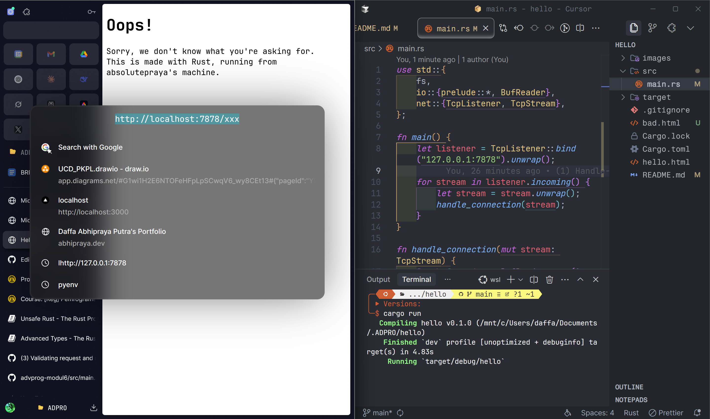
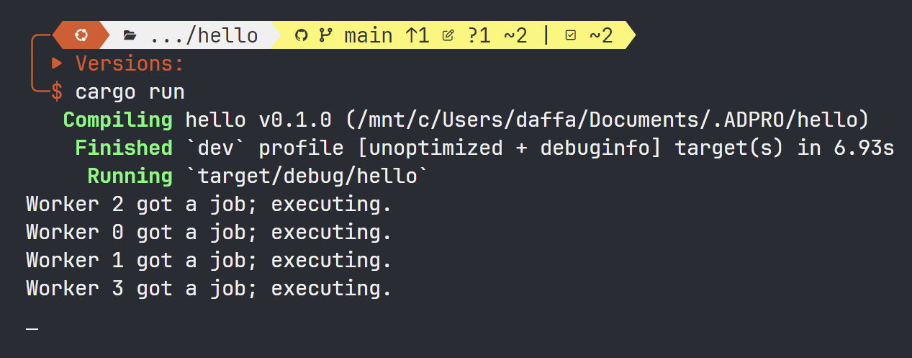

# Hello (Adv. Programming - Module 6)

**Daffa Abhipraya Putra - 2306245131**  
Adv. Programming B

## Contents

1. [Commit 1 Reflection](#commit-1-reflection)
2. [Commit 2 Reflection](#commit-2-reflection)
3. [Commit 3 Reflection](#commit-3-reflection)
4. [Commit 4 Reflection](#commit-4-reflection)
5. [Commit 5 Reflection](#commit-5-reflection)
6. [Commit Bonus Reflection](#commit-bonus-reflection)

## Commit 1 Reflection

For this commit, I built a basic HTTP server in Rust. I started by creating a new Rust project with `cargo new hello` and setting up GitHub version control.

The server uses Rust's standard library components:

- **TcpListener**: Binds to 127.0.0.1:7878 to listen for connections
- **TcpStream**: Handles client connections
- **BufReader**: Provides efficient I/O

The server implementation consists of:

- A main function that creates the listener and processes incoming connections in a loop
- A `handle_connection` function that reads HTTP requests from each connection and currently just prints the request data

This simple server demonstrates Rust's networking capabilities and safety features. Future work will include proper HTTP response handling and content serving.

## Commit 2 Reflection


In this commit, I enhanced the server to serve actual HTML content rather than just logging requests. This represents a significant step toward creating a functional web server.

Key changes:

1. **File System Integration**: Added the `fs` module to read HTML content from the file system.

2. **HTTP Response Generation**: Implemented proper HTTP response construction with:

   - Status line (`HTTP/1.1 200 OK`)
   - Content-Length header
   - The actual HTML content

3. **Content Serving**: Created a simple HTML file (`hello.html`) to serve to clients, featuring a greeting message.

4. **Complete Request-Response Cycle**: The server now completes the full HTTP cycle by not only reading requests but responding with meaningful content.

This implementation demonstrates how Rust's standard library provides the tools needed for complete web server functionality without external dependencies.

## Commit 3 Reflection



In this commit, I implemented basic routing functionality to provide appropriate responses based on the requested URL path. This represents a significant advancement in the server's capabilities, making it behave more like a real-world web server.

Key changes:

1. **Request Path Validation**: Added logic to extract and validate the request path from incoming HTTP requests.

2. **Conditional Response Generation**: Implemented conditional logic to:

   - Serve the main `hello.html` page for requests to the root path ("/")
   - Return a custom 404 error page for any other path

3. **Error Handling**: Created a dedicated "404 Not Found" HTML page (likely named `404.html`) to provide a better user experience when clients request non-existent resources.

4. **HTTP Status Codes**: Enhanced the response generation to include appropriate HTTP status codes:
   - `200 OK` for successful requests
   - `404 Not Found` for invalid paths

This implementation leverages Rust's pattern matching capabilities, making the route handling code both concise and readable. The server now properly follows HTTP protocol standards by responding with appropriate status codes based on the request content.

## Commit 4 Reflection

In this commit, I simulated a test scenario to find the problem of single-threaded server.

When running the server and accessing it with multiple browser tabs simultaneously, a critical performance bottleneck becomes apparent:

1. **Single-Threaded Blocking**: The current implementation processes one request at a time. This is demonstrated by having one browser tab request the `/sleep` endpoint (which deliberately sleeps for 10 seconds), while another tab requests the root path (`/`).

2. **Request Queuing**: Even though the request to the root path is simple and should be processed quickly, it gets stuck in a queue behind the long-running `/sleep` request. The second browser must wait for the first request to complete before being served.

3. **Poor Scalability**: This test demonstrates how the server would perform poorly with multiple concurrent users. As the number of users increases, each would experience progressively longer wait times regardless of what they're requesting.

4. **Real-World Implications**: In a production environment, this behavior would be unacceptable. A slow or complex request from one user would effectively block all other users from being served.

## Commit 5 Reflection



In this commit, I implemented a multi-threaded architecture using a ThreadPool to address the performance bottleneck identified in the previous commit.

Key changes:

1. **Added Multi-Threading**: Created a `ThreadPool` that manages a group of worker threads to handle connections in parallel.

2. **Improved Responsiveness**: The server now processes multiple requests at the same time:

   - Fast requests complete quickly even when slow requests are being processed
   - Users don't have to wait for others' requests to finish

3. **Better Performance**: The server can now handle more users at once without slowing down.

4. **Safe Implementation**: Used Rust's thread safety features (Arc, Mutex) to prevent data races.

5. **Clean Code Structure**: Separated the threading code into its own module for better organization.

## Commit Bonus Reflection

In this bonus commit, I enhanced the ThreadPool implementation by adding a more robust construction method, following Rust's best practices for error handling.

Key changes:

1. **Added Error-Handling Constructor**: Created a `build` function that returns a `Result` instead of panicking:

   ```rust
   pub fn build(size: usize) -> Result<ThreadPool, String> {
       if size == 0 {
           return Err(String::from("ThreadPool size must be greater than 0"));
       }
       // Create and return the ThreadPool
   }
   ```

2. **Better Error Management**: Users can now handle errors gracefully without crashes.

3. **Dual Construction Methods**: Kept both:

   - `new`: Panics on invalid input (standard Rust convention)
   - `build`: Returns Result for flexible error handling

4. **Improved Documentation**: Added clear function descriptions, parameter explanations, and error documentation.
